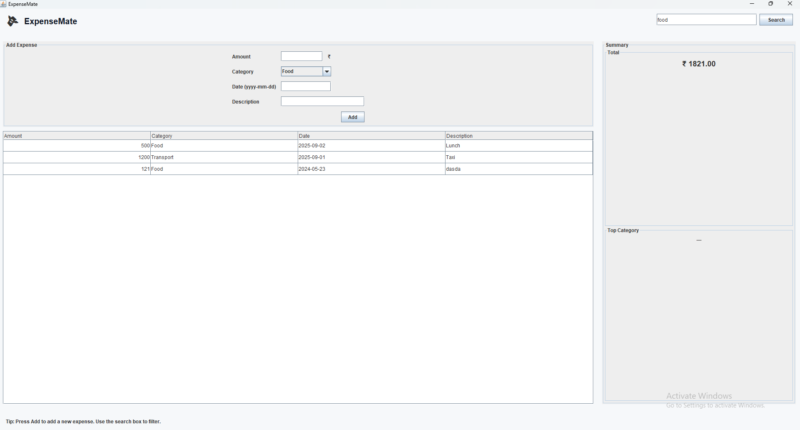

# Expense Tracker (Java Swing)

A simple, modern, and dependency-free Expense Tracker desktop application built with pure Java Swing. This project is ideal for learning Swing layouts, table handling, and basic UI design.

## Features
- Add expenses with amount, category, date, and description
- View all expenses in a sortable table
- See total expenses and top category summary
- Simple, clean UI with no external libraries required
- All data is kept in memory (no backend or file storage)

## Screenshots


## Getting Started

### Prerequisites
- Java JDK 8 or higher
- Git (optional, for cloning)

### Running the App
1. **Clone or download this repository**
   ```sh
   git clone https://github.com/yourusername/expense-tracker-swing.git
   cd expense-tracker-swing
   ```
2. **Compile the Java file**
   ```sh
   javac src/main/java/ExpenseTrackerUI.java
   ```
3. **Run the application**
   ```sh
   java -cp src/main/java ExpenseTrackerUI
   ```

### File Structure
```
.
├── src
│   └── main
│       └── java
│           └── ExpenseTrackerUI.java
├── README.md
└── screenshot.png
```

## Usage
- Enter the amount, select a category, date (as yyyy-mm-dd), and description, then click **Add**.
- All expenses appear in the table below.
- The right sidebar shows the total and top category.

## Customization
- You can easily extend this app to add file saving/loading, charts, or more advanced features.
- For a more modern look, you can integrate FlatLaf, LGoodDatePicker, Ikonli, and MiGLayout (see commented suggestions in code).

## License
MIT License. See [LICENSE](LICENSE) for details.

## Author
- [Your Name](https://github.com/yourusername)

---
Feel free to fork, star, and contribute!
